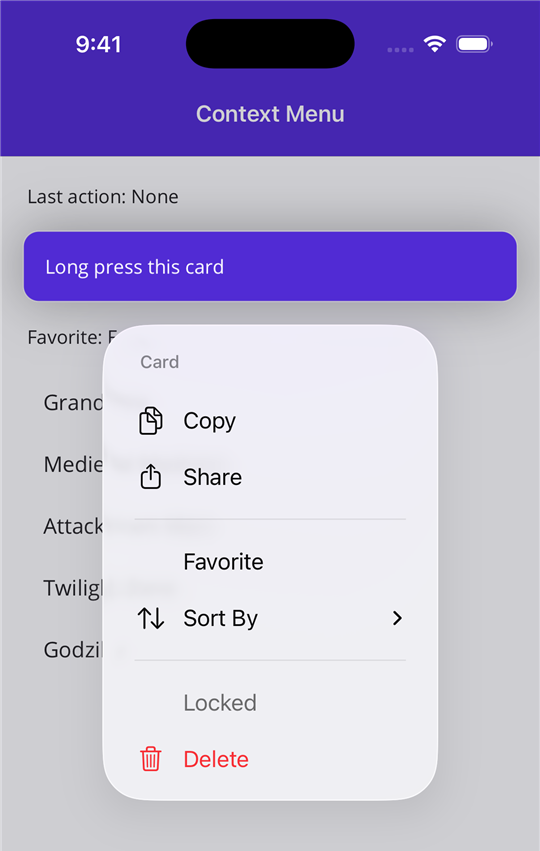
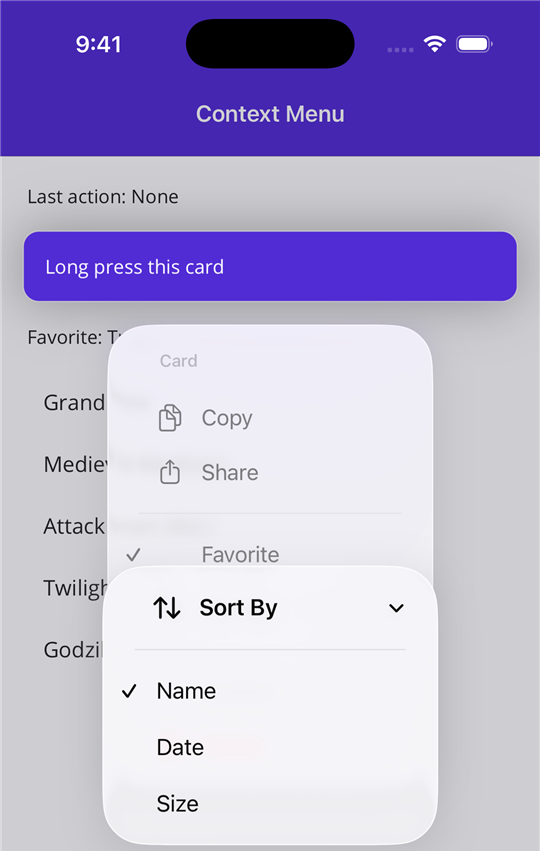
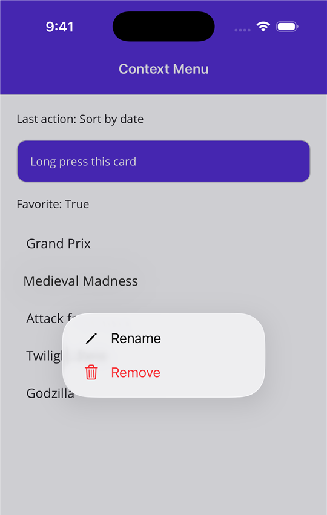
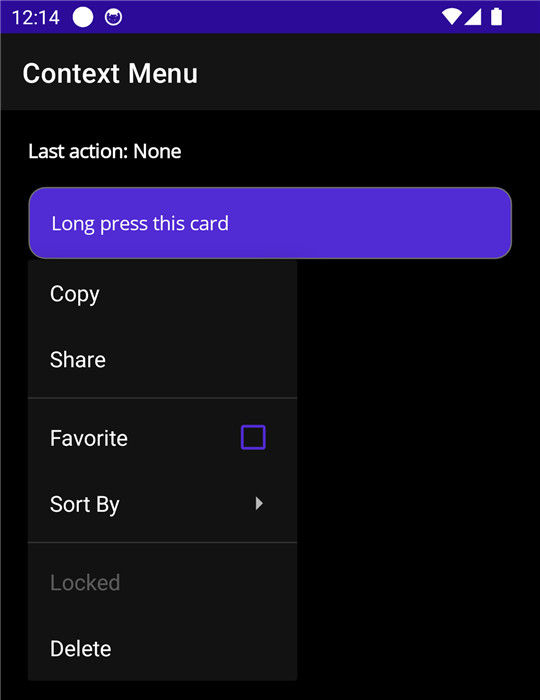
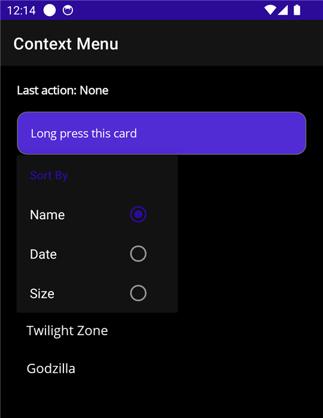
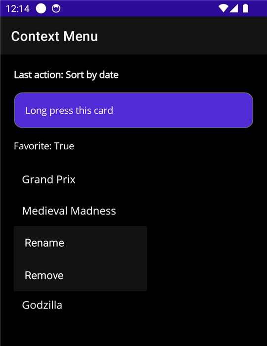

# Plugin.Maui.NativeContextMenus

[](https://www.nuget.org/packages/Plugin.Maui.NativeContextMenus/)

`Plugin.Maui.NativeContextMenus` adds native context menus to views in a .NET MAUI app.

.NET MAUI has a context menu (`FlyoutBase.ContextFlyout`) only on Windows and Mac Catalyst. This plugin gives the same function on iOS and Android.

## Screenshots

These screenshots show the sample app. The same XAML makes the menus on the two platforms.

|         | Menu with sections | Submenu with a radio group | Menu on a list item |
| ------- | ------------------ | -------------------------- | ------------------- |
| iOS     |  |  |  |
| Android |  |  |  |

## Supported Platforms

| Platform     | Minimum version | Native control                             | Gesture                    |
| ------------ | --------------- | ------------------------------------------ | -------------------------- |
| iOS          | 14.2            | `UIContextMenuInteraction` with a `UIMenu` | Long press                 |
| Mac Catalyst | 14.0            | `UIContextMenuInteraction` with a `UIMenu` | Secondary click            |
| Android      | API 21          | `PopupMenu` anchored to the view           | Long press                 |
| Windows      | Not supported   | Use `FlyoutBase.ContextFlyout`             |                            |

On Windows, use the [.NET MAUI context menu](https://learn.microsoft.com/dotnet/maui/user-interface/context-menu).

## Supported .NET Versions

The package has assemblies for .NET 9 and .NET 10.

| App target | Minimum .NET MAUI version |
| ---------- | ------------------------- |
| .NET 9     | 9.0.0                     |
| .NET 10    | 10.0.0                    |

## Installation

```xml
<PackageReference Include="Plugin.Maui.NativeContextMenus" Version="1.0.0" />
```

The context menu does not need a registration call in `MauiProgram.cs`.

## Usage

Add the XML namespace to the page:

```xml
xmlns:cm="clr-namespace:Plugin.Maui.NativeContextMenus;assembly=Plugin.Maui.NativeContextMenus"
```

Set the `NativeContextMenus.ContextMenu` attached property on a view:

```xml
<Border>
    <Label Text="Long press this card" />

    <cm:NativeContextMenus.ContextMenu>
        <cm:NativeContextMenu Title="Card">
            <cm:MenuNode Title="Copy" Icon="doc.on.doc" Command="{Binding CopyCommand}" />
            <cm:MenuNode Title="Share" Icon="square.and.arrow.up" Command="{Binding ShareCommand}" />

            <!-- A node with children and no Title is an inline section with dividers -->
            <cm:MenuNode>
                <cm:MenuNode Title="Favorite" IsCheckable="True" IsChecked="{Binding IsFavorite, Mode=TwoWay}" />

                <!-- A node with children and a Title is a submenu -->
                <cm:MenuNode Title="Sort By">
                    <cm:MenuNode Title="Name" GroupKey="sort" IsCheckable="True" IsChecked="True" />
                    <cm:MenuNode Title="Date" GroupKey="sort" IsCheckable="True" />
                </cm:MenuNode>
            </cm:MenuNode>

            <cm:MenuNode Title="Delete" Icon="trash" Destructive="True" Command="{Binding DeleteCommand}" />
        </cm:NativeContextMenu>
    </cm:NativeContextMenus.ContextMenu>
</Border>
```

The menu gets the `BindingContext` of the view. Thus bindings in a `MenuNode` work the same as bindings in the view.

### List items

In an item template, the `BindingContext` is the item. Use a `RelativeSource` binding to get a command from the page view model. Send the item as the parameter.

```xml
<CollectionView ItemsSource="{Binding Machines}">
    <CollectionView.ItemTemplate>
        <DataTemplate>
            <Grid Padding="12">
                <Label Text="{Binding Name}" />

                <cm:NativeContextMenus.ContextMenu>
                    <cm:NativeContextMenu>
                        <cm:MenuNode Title="Remove"
                                     Destructive="True"
                                     Command="{Binding RemoveCommand, Source={RelativeSource AncestorType={x:Type local:MachinesViewModel}}}"
                                     CommandParameter="{Binding .}" />
                    </cm:NativeContextMenu>
                </cm:NativeContextMenus.ContextMenu>
            </Grid>
        </DataTemplate>
    </CollectionView.ItemTemplate>
</CollectionView>
```

### C#

```csharp
var menu = new NativeContextMenu();
menu.Items.Add(new MenuNode { Title = "Copy", Command = copyCommand });
menu.Items.Add(new MenuNode { Title = "Delete", Destructive = true, Command = deleteCommand });

NativeContextMenus.SetContextMenu(label, menu);
```

Set the property to `null` to remove the menu.

## API

### NativeContextMenu

| Member       | Description                                                          |
| ------------ | -------------------------------------------------------------------- |
| `Items`      | The top-level `MenuNode` items. This is the XAML content property.   |
| `Title`      | Header text. iOS and Mac Catalyst only.                              |
| `ItemTapped` | Event. Occurs after the user taps a leaf node and its command runs.  |

### MenuNode

| Member             | Description                                                                             |
| ------------------ | --------------------------------------------------------------------------------------- |
| `Title`            | The text of the item.                                                                   |
| `Icon`             | The image of the item. Refer to [Icons](#icons).                                        |
| `Command`          | The command that runs when the user taps the item.                                      |
| `CommandParameter` | The parameter for `Command`.                                                            |
| `IsEnabled`        | `false` shows the item as disabled.                                                     |
| `IsVisible`        | `false` removes the item from the menu.                                                 |
| `Destructive`      | `true` shows the item in red. iOS and Mac Catalyst only.                                |
| `IsCheckable`      | `true` gives the item a check mark state.                                               |
| `IsChecked`        | The check mark state. A tap changes this value before the command runs.                 |
| `GroupKey`         | Checkable items with the same key are a radio group. A tap on one item clears the others. |
| `KeepMenuOpen`     | `true` keeps the menu open after a tap. iOS 16 and Mac Catalyst 16 or later only.       |
| `Children`         | Child items. This is the XAML content property.                                         |
| `Tapped`           | Event. Occurs after the user taps the item.                                             |

A node with `Children` and a `Title` is a submenu. A node with `Children` and no `Title` is an inline section.

The plugin builds the native menu each time the menu opens. As a result, the menu always shows the current property values.

### Icons

| Source            | iOS and Mac Catalyst                                    | Android                                        |
| ----------------- | ------------------------------------------------------- | ---------------------------------------------- |
| `FileImageSource` | An image in the app bundle. If there is no image with that name, the name is used as an SF Symbol name. | A drawable resource (this includes `MauiImage` files). Shown on API 29 or later. |
| `FontImageSource` | Supported.                                              | Not supported.                                 |
| Other sources     | Not supported.                                          | Not supported.                                 |

## Known Limits

- Android shows a `PopupMenu`. It does not show the lifted preview of the view that iOS shows.
- On Android, the plugin sets the long click listener of the platform view. A view cannot have a different long click listener at the same time.
- The menu of a parent view does not open from a child view that handles touch input itself (for example a `Button`).

## Toolbar Menus (experimental)

`NativeContextMenuToolbarItem` puts a `MenuNode` menu on a toolbar item. This part of the plugin is not complete. Refer to [TOOLBAR_MENU_USAGE.md](src/Plugin.Maui.NativeContextMenus/TOOLBAR_MENU_USAGE.md).

## Sample App

The [sample app](samples/) has a page for the view context menu and a page for the toolbar menu.

## License

MIT. Refer to [LICENSE](LICENSE).
